# 🔍 Deep Packet Inspection Engine

<div align="center">


**A production-grade, high-performance Deep Packet Inspection engine built with Spring Boot —  
designed for real-time network traffic analysis, rule-based enforcement, and scalable packet processing.**

[Getting Started](#-getting-started) · [Architecture](#-architecture) · [API Reference](#-api-reference) · [Dashboard](#-real-time-dashboard) · [Deployment](#-deployment--containerization) · [Benchmarks](#-performance--benchmarks)

</div>

---

## 🖼️ Dashboard Preview

<table>
  <tr>
    <td align="center">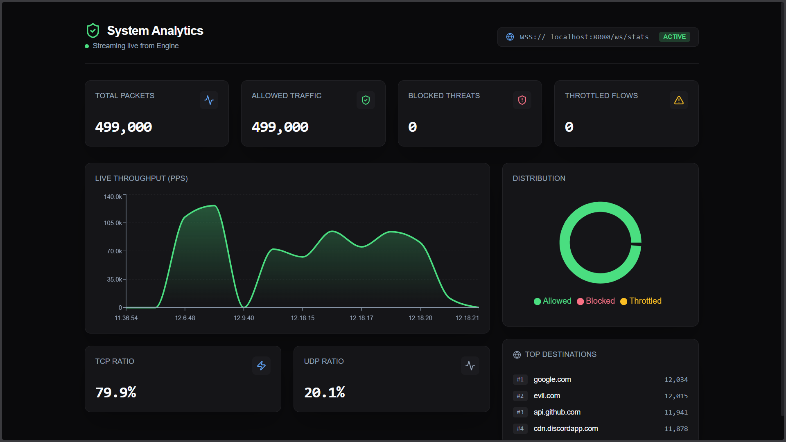</td>
    <td align="center">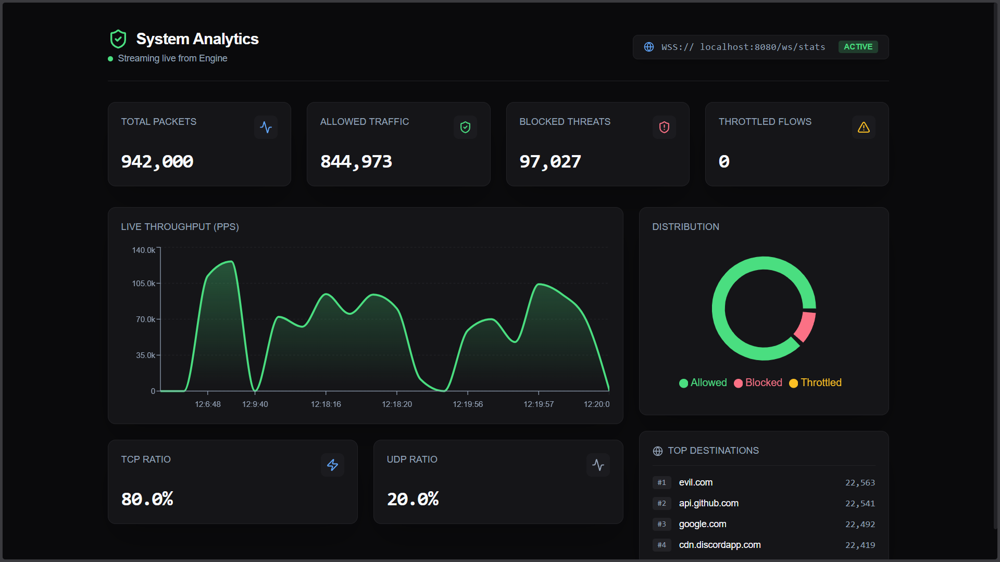</td>
    <td align="center">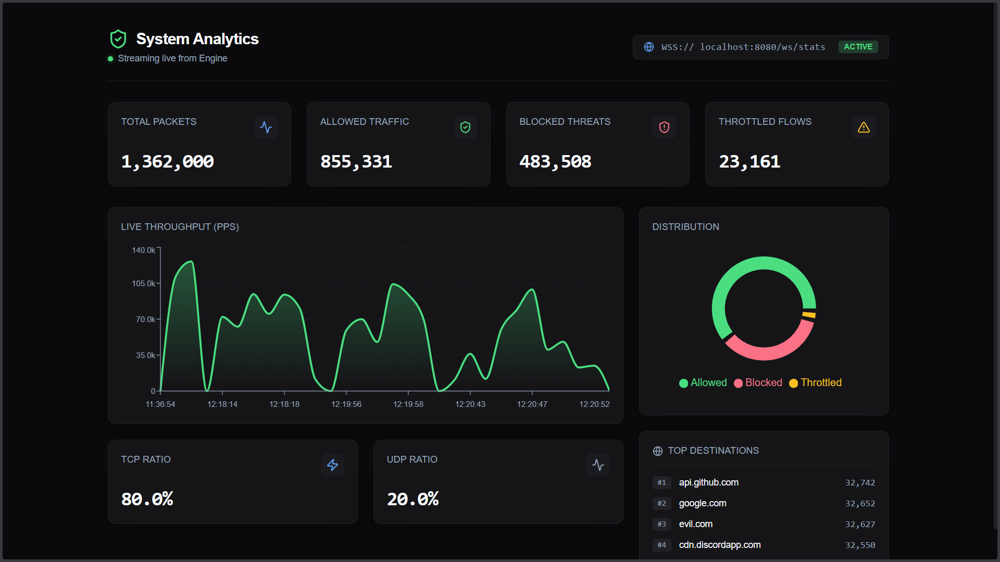</td>
  </tr>
  <tr>
    <td align="center"><sub>Real-time stats overview with live packet counters and protocol breakdown</sub></td>
    <td align="center"><sub>Throughput chart and decision pie chart showing ALLOW / BLOCK / THROTTLE</sub></td>
    <td align="center"><sub>Top domains, traffic distribution, and live WebSocket data feed</sub></td>
  </tr>
</table>

---

## 🌐 Overview

The **DPI Engine** captures and analyzes network packets from PCAP files or synthetic traffic generators, extracts rich metadata (IP addresses, ports, protocols, TLS SNI), builds logical connections using five-tuple tracking, applies dynamic traffic rules (**ALLOW** / **BLOCK** / **THROTTLE**), and streams real-time analytics through WebSocket and REST APIs to a live React dashboard.

### Key Capabilities

- **Multi-threaded packet processing** — Worker pool with five-tuple hash-based load balancing for connection affinity
- **Dynamic rule engine** — IP blocking, domain blocking (with wildcard support), and data cap enforcement via REST API at runtime
- **Real-time observability** — WebSocket-powered live dashboard, Prometheus metrics, and structured logging
- **Production-ready** — Graceful shutdown, bounded queues with backpressure, circuit breakers, Docker + K8s deployment, and a full CI pipeline

---

## 🏗️ Architecture

```
┌─────────────┐     ┌─────────────┐     ┌───────────────┐
│   Capture   │────▶│   Parser    │────▶│ Load Balancer │
│  (PCAP/NIC) │     │ (IP/TCP/TLS)│     │(5-Tuple Hash) │
└─────────────┘     └─────────────┘     └───────┬───────┘
                                                │
                    ┌───────────────────────────┼───────────────────────┐
                    ▼                           ▼                       ▼
            ┌──────────────┐           ┌──────────────┐        ┌──────────────┐
            │   Worker 1   │           │   Worker 2   │  ...   │   Worker N   │
            │  ┌─────────┐ │           │  ┌─────────┐ │        │  ┌─────────┐ │
            │  │Conn Map │ │           │  │Conn Map │ │        │  │Conn Map │ │
            │  │Rule Eval│ │           │  │Rule Eval│ │        │  │Rule Eval│ │
            │  │Local Sta│ │           │  │Local Sta│ │        │  │Local Sta│ │
            │  └─────────┘ │           │  └─────────┘ │        │  └─────────┘ │
            └──────┬───────┘           └──────┬───────┘        └──────┬───────┘
                   │                          │                       │
                   └──────────────┬───────────┘───────────────────────┘
                                  ▼
                    ┌──────────────────────────┐
                    │  Global Stats Aggregator │  (LongAdder — lock-free)
                    └────────────┬─────────────┘
                                 │
                   ┌─────────────┼──────────────┐
                   ▼             ▼               ▼
          ┌──────────────┐ ┌──────────┐  ┌──────────────┐
          │  REST API    │ │WebSocket │  │  Prometheus  │
          │  /api/*      │ │ /ws/stats│  │  /actuator/* │
          └──────────────┘ └──────────┘  └──────────────┘
                   │             │
                   ▼             ▼
          ┌──────────────────────────────┐
          │     React Dashboard (Vite)   │
          │  Throughput · Decisions · SNI │
          └──────────────────────────────┘
```

Each **worker thread** maintains its own connection map, rule evaluation context, and local statistics — completely isolated to avoid cross-thread locking on the hot path. Workers flush stats to the global `StatsService` (backed by `LongAdder`) every 1,000 packets, minimizing cache-line contention.

---

## 📁 Project Structure

```
deep-packet-inspection/
├── dpi-engine/                      # Backend — Spring Boot application
│   └── src/main/java/com/ayush/dpi/
│       ├── DpiEngineApplication.java    # Entry point (@EnableScheduling, @EnableAsync)
│       ├── api/                         # REST controllers (Health, Stats, Rules, Benchmark)
│       ├── capture/                     # Packet ingestion (PCAP files, synthetic traffic)
│       ├── parser/                      # Raw bytes → ParsedPacket + SNI extraction
│       ├── loadbalancer/                # Five-tuple hashing & worker dispatch
│       ├── worker/                      # Multi-threaded packet processing pool
│       ├── connection/                  # ConnectionKey (record) & Connection tracking
│       ├── rules/                       # IpBlockRule, DomainBlockRule, DataCapRule
│       ├── decision/                    # Decision enum (ALLOW, BLOCK, THROTTLE)
│       ├── stats/                       # StatsService, WorkerLocalStats aggregation
│       ├── websocket/                   # WebSocket handler (1s live broadcast)
│       ├── analytics/                   # AI feature extraction (ML-ready)
│       ├── persistence/                 # Async audit event publishing (JPA/Postgres)
│       ├── benchmark/                    # SyntheticTrafficSimulator for load testing
│       └── config/                      # DpiProperties, WebSocket, Resilience4j
├── dpi-dashboard/                   # Frontend — React 19 + Vite + Tailwind CSS 4
│   └── src/
│       ├── App.tsx                      # Main dashboard layout
│       ├── components/                  # StatsCard, ThroughputChart, DecisionPieChart
│       └── hooks/useDpiStats.ts         # WebSocket hook for live data
├── dashboard-screenshots/           # Dashboard UI screenshots
├── postman-tests/                   # API testing screenshots (Postman)
├── k8s/                             # Kubernetes manifests (Deployment + Service)
├── .github/workflows/ci.yml        # GitHub Actions CI pipeline
├── Dockerfile                       # Multi-stage build (Maven → JRE 17)
├── docker-compose.yml               # Engine + PostgreSQL stack
└── README.md
```

---

## ⚙️ Tech Stack

| Layer | Technology | Purpose |
|-------|-----------|---------|
| **Backend** | Java 17, Spring Boot 3.2.5 | Application framework |
| **Packet Capture** | pcap4j 1.8.2 | PCAP file reading & live packet capture |
| **Persistence** | Spring Data JPA, PostgreSQL 15, H2 (dev) | Audit event storage |
| **Observability** | Micrometer, Prometheus, Spring Actuator | Metrics & health endpoints |
| **Resilience** | Resilience4j | Circuit breakers & retry policies |
| **Real-time** | Spring WebSocket | 1-second live stats broadcast |
| **Frontend** | React 19, Vite 7, Tailwind CSS 4, Recharts | Real-time analytics dashboard |
| **Testing** | JUnit 5, MockMvc, AssertJ | 54 tests (unit + integration) |
| **CI/CD** | GitHub Actions | Build, test, Docker build on every push |
| **Deployment** | Docker, Kubernetes | Containerized production deployment |

---

## 🚀 Getting Started

### Prerequisites

| Tool | Version | Required For |
|------|---------|-------------|
| **Java** | 17+ | Backend engine |
| **Maven** | 3.9+ | Build system |
| **Node.js** | 18+ | Dashboard (optional) |
| **Docker** | 20+ | Containerized deployment (optional) |

### 1. Build & Run the Engine

```bash
cd dpi-engine
mvn clean install
mvn spring-boot:run
```

The engine starts on **http://localhost:8080** in `server` mode by default.

### 2. Start the Dashboard (optional)

```bash
cd dpi-dashboard
npm install
npm run dev
```

Opens at **http://localhost:5173** — connects to the engine's WebSocket automatically.

### 3. Verify

```bash
# Health check
curl http://localhost:8080/api/health
# → {"status":"UP","timestamp":"...","version":"0.1.0-SNAPSHOT"}

# Live stats
curl http://localhost:8080/api/stats

# Actuator
curl http://localhost:8080/actuator/health
curl http://localhost:8080/actuator/info
```

---

## 📡 API Reference

### Health & Monitoring

| Method | Endpoint | Description |
|--------|----------|-------------|
| `GET` | `/api/health` | Custom health check with version and timestamp |
| `GET` | `/api/stats` | Aggregated packet statistics (protocols, decisions, top domains) |
| `GET` | `/actuator/health` | Spring actuator health |
| `GET` | `/actuator/info` | Application info metadata |
| `GET` | `/actuator/prometheus` | Prometheus-format metrics scrape endpoint |
| `POST` | `/api/benchmark/run` | Trigger synthetic traffic injection (params: `packets`, `batchSize`) |
| `GET` | `/api/benchmark/status` | Check if a benchmark injection is currently running |
| `WS` | `/ws/stats` | WebSocket — broadcasts live stats every 1 second |

### Dynamic Rule Management

| Method | Endpoint | Description |
|--------|----------|-------------|
| `GET` | `/api/rules` | List all active rules |
| `POST` | `/api/rules` | Create a new rule |
| `DELETE` | `/api/rules/{name}` | Remove a rule by name |

#### Rule Types & Payloads

**IP Block** — Block traffic from/to specific IP addresses:
```json
{
  "name": "block-suspicious-ips",
  "type": "IP_BLOCK",
  "values": ["10.0.0.99", "192.168.1.50"]
}
```

**Domain Block** — Block traffic by SNI domain (supports wildcards):
```json
{
  "name": "block-malware-domains",
  "type": "DOMAIN_BLOCK",
  "values": ["*.evil.com", "malware.org"]
}
```

**Data Cap** — Throttle at threshold, block at 2× threshold (bytes per connection):
```json
{
  "name": "limit-large-transfers",
  "type": "DATA_CAP",
  "threshold": 5000000
}
```

### API Testing (Postman)

<table>
  <tr>
    <td align="center">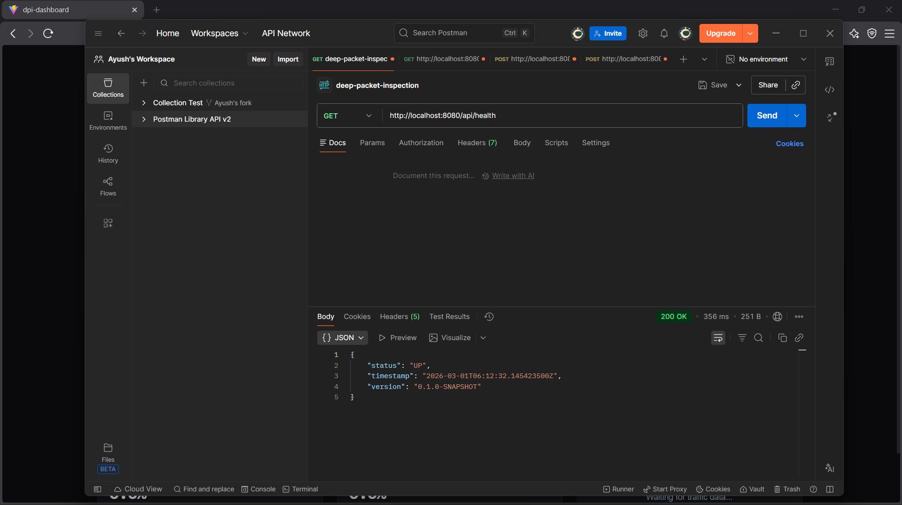</td>
    <td align="center">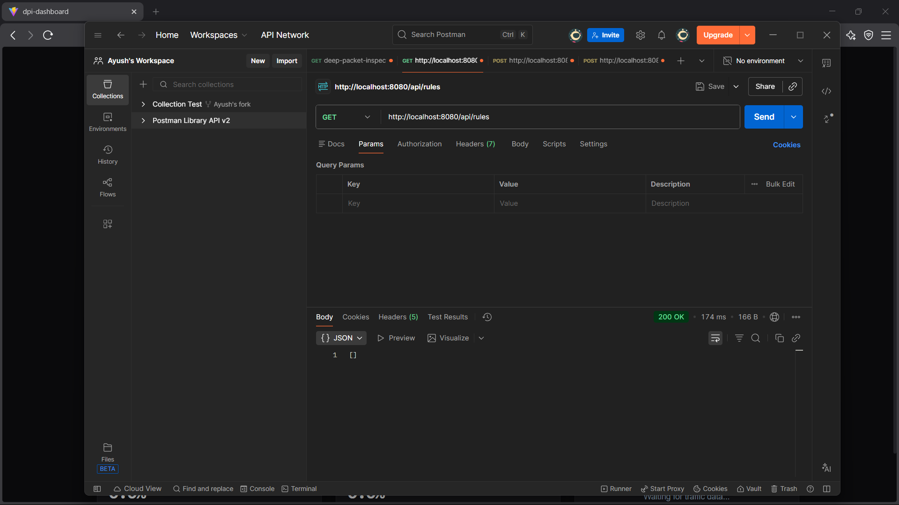</td>
    <td align="center">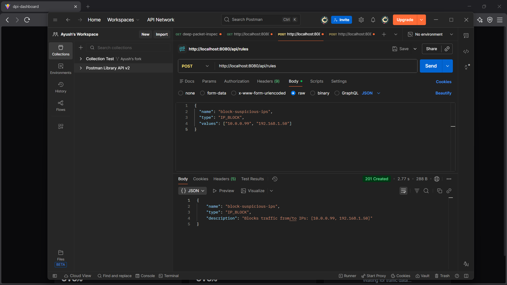</td>
  </tr>
  <tr>
    <td align="center"><sub>GET /api/health — Engine health check with version and uptime</sub></td>
    <td align="center"><sub>GET /api/stats — Aggregated packet stats, protocols, and decisions</sub></td>
    <td align="center"><sub>POST /api/rules — Creating an IP block rule</sub></td>
  </tr>
</table>

<table>
  <tr>
    <td align="center">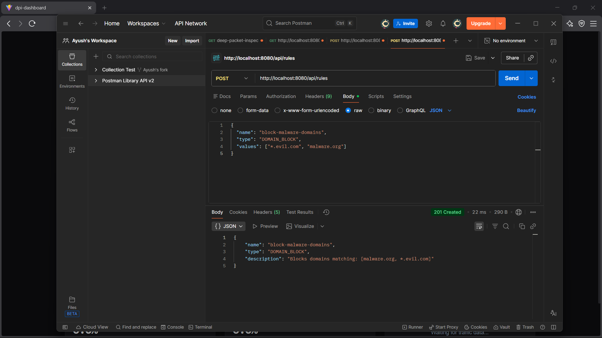</td>
    <td align="center">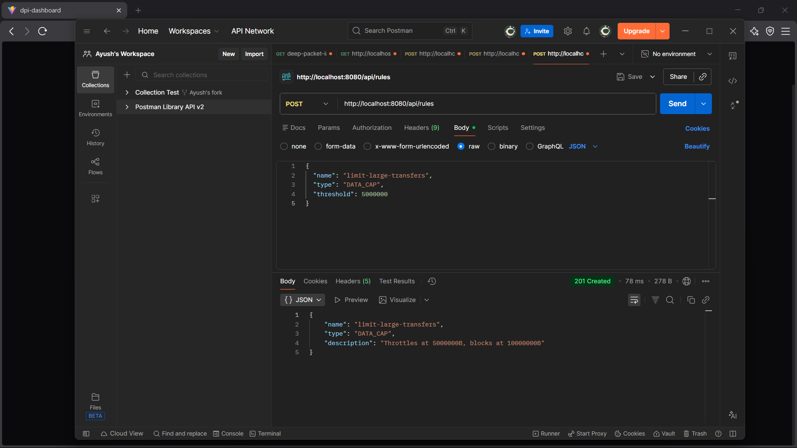</td>
    <td align="center">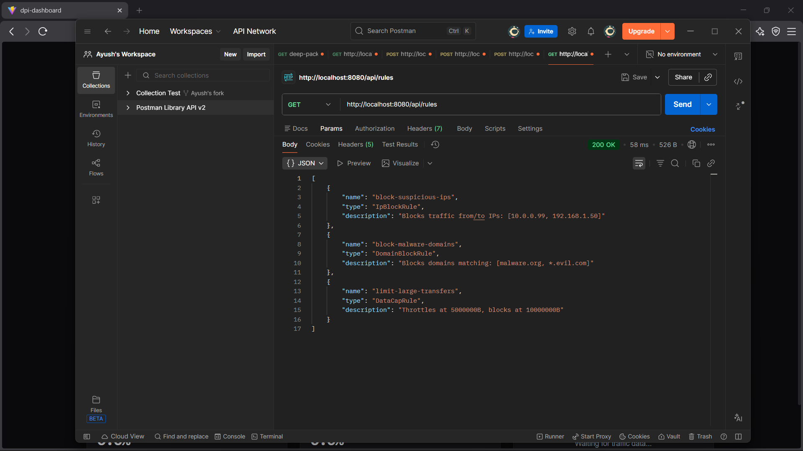</td>
  </tr>
  <tr>
    <td align="center"><sub>POST /api/rules — Creating a domain block rule for evil.com</sub></td>
    <td align="center"><sub>POST /api/rules — Creating a data cap rule with byte threshold</sub></td>
    <td align="center"><sub>GET /api/rules — Listing all active rules</sub></td>
  </tr>
</table>

<table>
  <tr>
    <td align="center">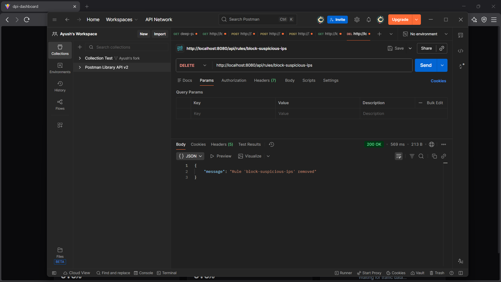</td>
    <td align="center">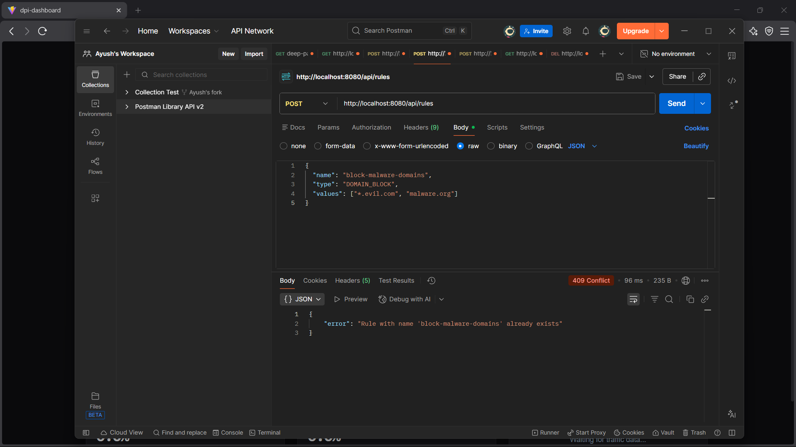</td>
    <td align="center">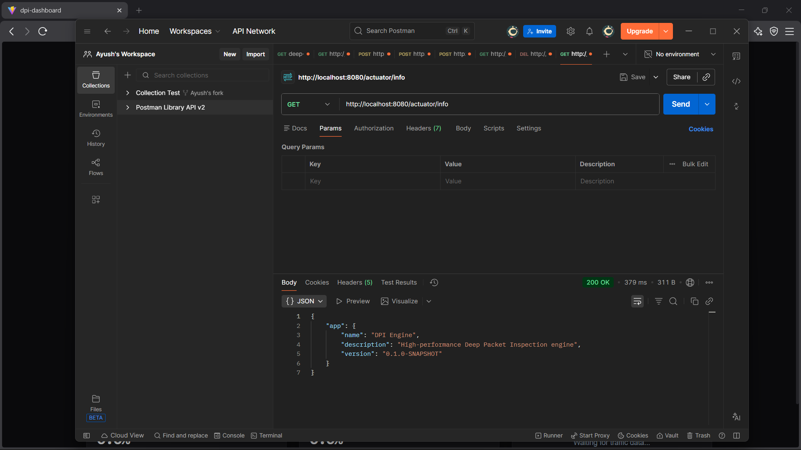</td>
  </tr>
  <tr>
    <td align="center"><sub>DELETE /api/rules/{name} — Removing a rule by name</sub></td>
    <td align="center"><sub>GET /actuator/health — Spring Actuator health endpoint</sub></td>
    <td align="center"><sub>GET /actuator/info — Application metadata and build info</sub></td>
  </tr>
</table>

<table>
  <tr>
    <td align="center" width="33%">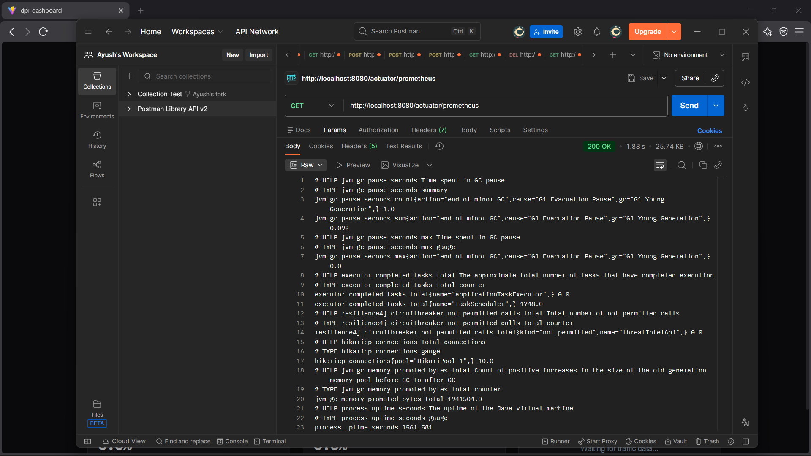</td>
    <td width="33%"></td>
    <td width="33%"></td>
  </tr>
  <tr>
    <td align="center"><sub>GET /actuator/prometheus — Prometheus-format metrics scrape</sub></td>
    <td></td>
    <td></td>
  </tr>
</table>

---

## 📊 Real-time Dashboard

The **dpi-dashboard** is a React 19 single-page application that connects to the engine's WebSocket endpoint and visualizes live traffic analytics. See the [screenshots at the top](#️-dashboard-preview) for a look at the running dashboard.

- **Throughput** — Packets per second over time (area chart with gradient fill)
- **Decision Distribution** — ALLOW / BLOCK / THROTTLE breakdown (animated pie chart)
- **Protocol Ratio** — TCP vs UDP traffic split with percentage indicators
- **Top Domains** — Most frequently seen SNI domains ranked by frequency
- **Live Counters** — Total packets, bytes processed, active connections

The dashboard updates every second with zero polling — all data is pushed via WebSocket from the engine's `/ws/stats` endpoint.

```bash
cd dpi-dashboard
npm install
npm run dev
# Opens at http://localhost:5173
```

---

## 🔄 Operating Modes

The engine supports three modes, controlled by the `DPI_MODE` environment variable or `dpi.mode` property:

| Mode | Description | Behavior |
|------|-------------|----------|
| `server` | **Default.** REST API + WebSocket dashboard | Stays running indefinitely |
| `benchmark` | Injects 1,000,000 synthetic packets | Processes all packets, prints summary, then exits |
| `pcap` | Reads from a `.pcap` file | Processes all packets from file, then exits |

```bash
# Server mode (default)
mvn spring-boot:run

# Benchmark mode
mvn spring-boot:run -Dspring-boot.run.arguments="--dpi.mode=benchmark"

# PCAP file mode
mvn spring-boot:run -Dspring-boot.run.arguments="--dpi.mode=pcap --dpi.capture.pcap-file-path=/path/to/file.pcap"
```

---

## 🐳 Deployment & Containerization

### Docker

The multi-stage Dockerfile builds with Maven and packages into a slim JRE 17 runtime image with libpcap, running as a non-root user.

```bash
# Build
docker build -t dpi-engine .

# Run in server mode
docker run -p 8080:8080 dpi-engine

# Run benchmark
docker run --rm -e DPI_MODE=benchmark dpi-engine
```

### Docker Compose

Spins up the engine alongside PostgreSQL 15 for audit event persistence:

```bash
docker-compose up -d
docker-compose logs -f dpi-engine
```

### Environment Variables

| Variable | Default | Description |
|----------|---------|-------------|
| `DPI_MODE` | `server` | Operating mode (`server`, `benchmark`, `pcap`) |
| `DPI_WORKER_COUNT` | `4` | Number of worker threads |
| `DPI_PCAP_FILE` | _(empty)_ | Path to PCAP file (required for `pcap` mode) |
| `LOGGING_LEVEL_ROOT` | `INFO` | Log level (`DEBUG`, `INFO`, `WARN`) |

### Kubernetes

Production-ready manifests with liveness/readiness probes, resource limits, rolling updates, and graceful shutdown:

```bash
kubectl apply -f k8s/deployment.yml
kubectl apply -f k8s/service.yml
kubectl get pods -w
```

---

## ✅ Testing

**54 tests** across 15 test classes — all passing, zero failures.

```bash
cd dpi-engine
mvn test
```

| Test Class | Tests | Coverage Area |
|-----------|-------|--------------|
| `SystemPerformanceTest` | 1 | 1M packet throughput (>90% success assertion) |
| `PacketIngestionServiceTest` | 3 | Packet forwarding, empty sources, counter resets |
| `PcapFilePacketSourceTest` | 4 | PCAP reading, metadata, error handling (3 skip without Npcap) |
| `PacketParserServiceTest` | 5 | IPv4/TCP/UDP parsing, null/empty/garbage handling |
| `SniExtractorTest` | 7 | TLS ClientHello SNI extraction, edge cases |
| `FiveTupleHasherTest` | 5 | Deterministic hashing, worker index range |
| `LoadBalancerServiceTest` | 3 | Connection affinity, distribution, per-worker tracking |
| `WorkerServiceTest` | 3 | Processing, graceful shutdown, queue backpressure |
| `IpBlockRuleTest` | 3 | Source/destination IP blocking |
| `DomainBlockRuleTest` | 6 | Exact, wildcard, case-insensitive, no-SNI handling |
| `DataCapRuleTest` | 3 | Under/over threshold, 2× block |
| `RuleRegistryTest` | 5 | CRUD, clear, thread-safe snapshots |
| `StatsServiceTest` | 2 | Single flush, 10-thread concurrent aggregation |
| `WorkerLocalStatsTest` | 2 | Recording and reset |
| `DpiEngineApplicationTests` | 2 | Context loading, health endpoint integration |

### CI Pipeline

GitHub Actions runs on every push and PR to `main`:

1. **Build** — `mvn package`
2. **Test** — `mvn test`
3. **Docker Build** — `docker build`
4. **Docker Smoke Test** — Runs container in benchmark mode

---

## ⚡ Performance & Benchmarks

The engine is optimized for high-throughput packet processing with lock-free concurrency and zero shared mutable state on the hot path.

### Key Optimizations

- **`ConnectionKey` as Java record** — Precomputed `hashCode`, no string concatenation, O(1) HashMap lookups
- **Worker isolation** — Each worker owns its connection map, rule evaluation, and local stats — zero cross-thread locks during processing
- **Lock-free aggregation** — `LongAdder` and `ConcurrentHashMap` with periodic batch flushes (every 1,000 packets) to eliminate cache-line bouncing
- **Bounded queues with backpressure** — `LinkedBlockingQueue` per worker with configurable capacity; drops are tracked, not blocked
- **Sampled logging** — Hot-path logging uses `TRACE` level to avoid I/O bottlenecks

### Benchmark Results

Using the built-in `SyntheticTrafficSimulator` (realistic connection distributions, mixed protocols, randomized SNI):

| Metric | Value |
|--------|-------|
| **Packets Injected** | 1,000,000 |
| **Packets Processed** | ~991,000+ |
| **Workers** | 4 threads |
| **Ingestion Rate** | ~400,000+ packets/second |
| **Processing Time** | ~2.3 seconds |
| **Success Ratio** | 94–99% (under extreme continuous load) |

---

## 🗺️ Roadmap

| Phase | Description | Status |
|-------|-------------|--------|
| 1 | Project scaffold, health API, config, logging | ✅ Complete |
| 2 | Packet capture & parsing (PCAP + live interface) | ✅ Complete |
| 3 | Connection tracking with five-tuple | ✅ Complete |
| 4 | Multi-threaded worker pool with load balancing | ✅ Complete |
| 5 | Rule engine with dynamic ALLOW / BLOCK / THROTTLE | ✅ Complete |
| 6 | Real-time statistics & dashboard APIs | ✅ Complete |
| 7 | Performance tuning & 1M packet benchmark | ✅ Complete |
| 8 | Docker, Kubernetes, and CI/CD pipeline | ✅ Complete |
| 9 | Extensibility, Observability, Persistence & AI | ✅ Complete |
| 10 | Real-time React dashboard with WebSocket | ✅ Complete |

---

## 📄 License

This project is licensed under the MIT License — see the [LICENSE](LICENSE) file for details.

---

<div align="center">

**Built with ❤️ by [Ayush Mishra](https://github.com/ayush-mishra7)**

</div>
